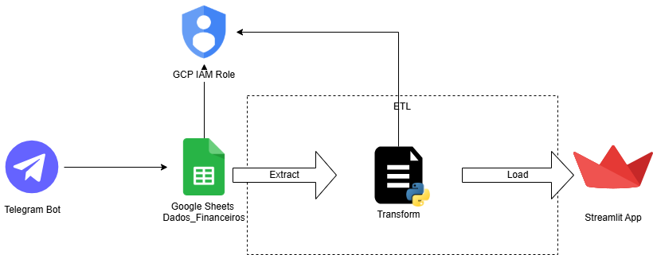

# 💰 Minhas Finanças - Telegram Bot

Este projeto é um assistente financeiro automatizado que utiliza o **Telegram** como interface de entrada de dados (Ingestion) para alimentar uma planilha no **Google Sheets**. O sistema foi desenhado como um pipeline de dados inteligente que adapta suas perguntas com base no tipo de movimentação financeira.

## 🏗️ Arquitetura do Sistema

O fluxo de dados segue uma estrutura de micro-serviço integrada ao Google Cloud:



1.  **Interface (Telegram Bot):** Captura os dados brutos via `python-telegram-bot`.
2.  **Processamento (Backend Python):** Gerencia a máquina de estados (ConversationHandler) e valida os inputs.
3.  **Destino (Google Sheets):** Armazena os dados normalizados para posterior análise e criação de dashboards.

---

## 🚀 Funcionalidades e Fluxos

O bot utiliza lógica condicional para garantir que apenas os dados necessários sejam coletados, otimizando a experiência do usuário:

### 1. Gastos e Rendimentos
Fluxo padrão para controle de fluxo de caixa mensal.
* **Perguntas:** Valor ➡️ Categoria ➡️ Instituição ➡️ Descrição.

### 2. Investimentos
Fluxo detalhado para acompanhamento de patrimônio.
* **Perguntas:** Valor ➡️ Produto (ex: CDB) ➡️ Tipo (Aplicação/Retirada) ➡️ Vencimento ➡️ Indicador (ex: CDI) ➡️ Instituição.

### 3. Receita
Fluxo expresso para ganhos rápidos.
* **Perguntas:** Valor (Finaliza o registro automaticamente).

---

## 🛠️ Configuração

### Pré-requisitos
* Python 3.10 ou superior.
* Uma conta no Google Cloud com a **Google Sheets API** e **Google Drive API** ativas.
* Arquivo de credenciais (`credentials.json`) da conta de serviço.

### Variáveis de Ambiente (Streamlit Secrets)
Para rodar no Streamlit Cloud ou localmente, configure o arquivo `.streamlit/secrets.toml`:

```toml
bot_token = "SUA_TOKEN_DO_BOT_AQUI"
SHEET_ID = "ID_DA_SUA_PLANILHA_GOOGLE"

[gcp_service_account]
type = "service_account"
project_id = "seu-projeto"
private_key_id = "..."
private_key = "..."
client_email = "..."
client_id = ""
auth_uri = ""
token_uri = ""
auth_provider_x509_cert_url = ""
client_x509_cert_url = ""
universe_domain = "googleapis.com"
```
--

## 📂 Estrutura de Pastas

├── bot/
│   └── bot.py            # Lógica da interface e máquina de estados
├── config/
│   └── auth.py           # Autorização para acessar o Google Sheets
├── etl/
│   └── transform.py      # Lógica para transformação dos dados
├── data/
│   └── google_sheets.py  # Funções de integração (ETL/Load)
├── images/
|   └── Imagens Bancos
│   └── Minhas_Finanças_App.drawio  # Diagrama da arquitetura
├── .streamlit/
│   └── secrets.toml      # Configurações sensíveis (não versionar!)
└── requirements.txt      # Dependências do projeto

## 📝 Comandos Bot
* /registrar: Inicia um novo lançamento financeiro.

* /cancelar: Interrompe o fluxo atual e limpa os dados temporários.